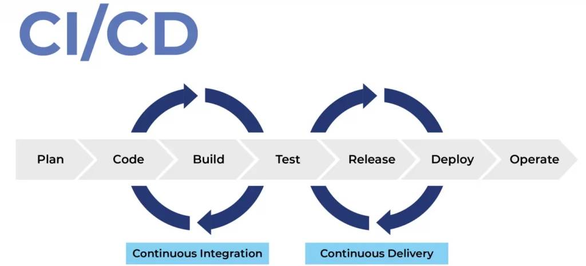

#### Quy trình hoạt động CI/CD

Nếu muốn hiểu kỹ hơn về cách thức hoạt động của quy trình CI/CD, bạn cần nắm được các bước tiến hành cụ thể trong quy trình đó. Vậy những bước này bao gồm những gì và chúng hoạt động ra sao?
 
+ **Tích hợp Liên tục (CI)** là quy trình đầu tiên, nơi mà các lập trình viên thường xuyên hợp nhất code của họ vào một kho lưu trữ chung như Git, nhiều lần trong ngày. Mỗi lần hợp nhất thường được xây dựng và kiểm thử tự động để phát hiện lỗi càng sớm càng tốt, giảm thiểu việc tích tụ lỗi và giảm thời gian cần thiết để hoàn thành và cho ra sản phẩm chất lượng.
+ **Phân phối liên tục (CD)** là mở rộng CI bằng cách đảm bảo rằng bạn có thể phát hành phiên bản mới của phần mềm vào bất kỳ thời điểm nào. Trong CD, việc xây dựng, kiểm thử và chuẩn bị cho việc phát hành mã nguồn được tự động hóa.
+ **Triển khai liên tục (CD)** là một bước tiếp theo của CD, nơi phát hành tự động các thay đổi mã nguồn đã qua kiểm thử vào môi trường sản xuất. Điều này giúp mọi thay đổi sau khi được kiểm tra có thể được triển khai một cách tự động. 

Quá trình vòng đời phát triển cùng với các bước làm việc trong CI/CD diễn ra như sau:

+ **Build**: Tạo sản phẩm từ mã nguồn, tích hợp và phát hiện lỗi.
+ **Test**: Tự động kiểm tra tính năng mới và code thay đổi.
+ **Deliver**: Đưa code đã kiểm tra vào môi trường test, có thể tự động hoặc sau khi được chấp thuận từ con người.
+ **Deploy**: Áp dụng các thay đổi lên sản phẩm, tự động hoặc theo phê duyệt từ con người.

