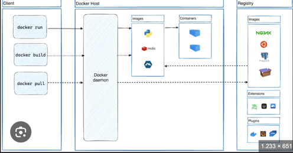

## Theory Docker Project

### Introduction to Docker

- Docker is an open-source platform that automates the deployment
- Docker packages your application and all its dependencies into an image. A Docker image contains everything needed to run your application

### Key Concepts

1. **Containers**: Containers are lightweight, portable, and run isolated processes on a shared operating system. They contain everything needed to run an application, including code, runtime, libraries, and settings.

2. **Images**: Images are read-only templates used to create containers. They are built from a Dockerfile and include the application code, dependencies, and the runtime environment.

3. **Dockerfile**: A Dockerfile is a script containing instructions on how to build a Docker image. It specifies the base image, application code, environment variables, and commands to run.

4. **Docker Hub**: Docker Hub is a cloud-based repository where users can find and share Docker images. It provides a centralized place to store and manage Docker images.

### Advantages of Docker

- **Portability**: Containers can run on any system with Docker installed, ensuring consistent behavior across development, testing, and production environments.
- **Efficiency**: Containers share the host system's kernel, making them more lightweight and efficient compared to virtual machines.
- **Scalability**: Docker enables easy scaling of applications by deploying multiple containers across various environments.
- **Isolation**: Containers run in isolated environments, preventing conflicts between applications and enhancing security.

### Docker Architecture

1. **Docker Engine**: The core component of Docker, responsible for creating and managing containers. It consists of:
    - **Docker Daemon**: The background service running on the host machine that manages Docker objects (images, containers, networks, volumes).
    - **Docker CLI**: The command-line interface used to interact with the Docker Daemon.

2. **Docker Objects**:
    - **Images**: Immutable files used to create containers.
    - **Containers**: Running instances of images that can be started, stopped, moved, and deleted.
    - **Networks**: Enable communication between Docker containers.
    - **Volumes**: Provide persistent storage for containers.

### Basic Docker Commands

- `docker run`: Create and start a new container from an image.
- `docker build`: Build an image from a Dockerfile.
- `docker pull`: Download an image from a registry.
- `docker push`: Upload an image to a registry.
- `docker ps`: List running containers.
- `docker stop`: Stop a running container.
- `docker rm`: Remove a container.
- `docker rmi`: Remove an image.

### Example: Creating a Docker Image

Here's an example of a simple Dockerfile to create a Docker image for a Python application:

```dockerfile
# Use the official Python base image
FROM python:3.8-slim

# Set the working directory
WORKDIR /app

# Copy the current directory contents into the container
COPY . /app

# Install any needed packages specified in requirements.txt
RUN pip install --no-cache-dir -r requirements.txt

# Make port 80 available to the world outside this container
EXPOSE 80

# Define the command to run the application
CMD ["python", "app.py"]
