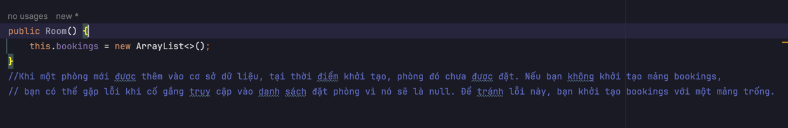

## Khởi Tạo `bookings` Trong Lớp `HotelRoom`

Khi bạn có một lớp với thuộc tính như `bookings`, có hai cách phổ biến để khởi tạo thuộc tính này: thông qua constructor không tham số hoặc constructor có tham số. Dưới đây là giải thích chi tiết về từng phương pháp:


### 1. Constructor Không Tham Số

Constructor không tham số là một phương thức đặc biệt trong lớp, không nhận bất kỳ tham số nào và được sử dụng để khởi tạo các thuộc tính của lớp với giá trị mặc định.

**Ví dụ:**

```java
public class HotelRoom {
    private List<Booking> bookings;

    // Constructor không tham số
    public HotelRoom() {
        this.bookings = new ArrayList<>(); // Khởi tạo bookings với một danh sách trống
    }
}
```
#### Giải Thích:
- Khi bạn tạo một đối tượng của lớp HotelRoom bằng constructor không tham số, bookings sẽ được khởi tạo với một danh sách trống (new ArrayList<>()). Điều này đảm bảo rằng bookings không phải là null và có thể được sử dụng ngay lập tức mà không gặp lỗi.

### 2. Constructor Có Tham Số
Constructor có tham số cho phép bạn truyền giá trị vào khi tạo đối tượng, giúp khởi tạo các thuộc tính của lớp với các giá trị cụ thể.

**Ví dụ:**

```java
public class HotelRoom {
    private List<Booking> bookings;

    // Constructor có tham số để truyền danh sách bookings
    public HotelRoom(List<Booking> bookings) {
        this.bookings = bookings; // Khởi tạo bookings với giá trị truyền vào
    }
}
```
#### Giải Thích:

- Khi bạn tạo một đối tượng của lớp HotelRoom bằng constructor có tham số, bạn truyền một danh sách đặt phòng (hoặc một danh sách khác) vào. bookings sẽ được khởi tạo với giá trị mà bạn truyền vào. Nếu bạn truyền vào một danh sách không rỗng hoặc có giá trị cụ thể, bookings sẽ chứa các giá trị đó.
Tóm Tắt
- Constructor Không Tham Số: Khởi tạo bookings với một danh sách trống để đảm bảo không gặp lỗi NullPointerException khi truy cập hoặc thao tác với bookings.
- Constructor Có Tham Số: Cho phép bạn khởi tạo bookings với giá trị cụ thể từ bên ngoài, thuận tiện khi bạn có dữ liệu sẵn có và muốn khởi tạo đối tượng với dữ liệu đó.
Lựa chọn giữa hai phương pháp phụ thuộc vào yêu cầu của ứng dụng và cách bạn muốn khởi tạo các đối tượng trong lớp của bạn.)