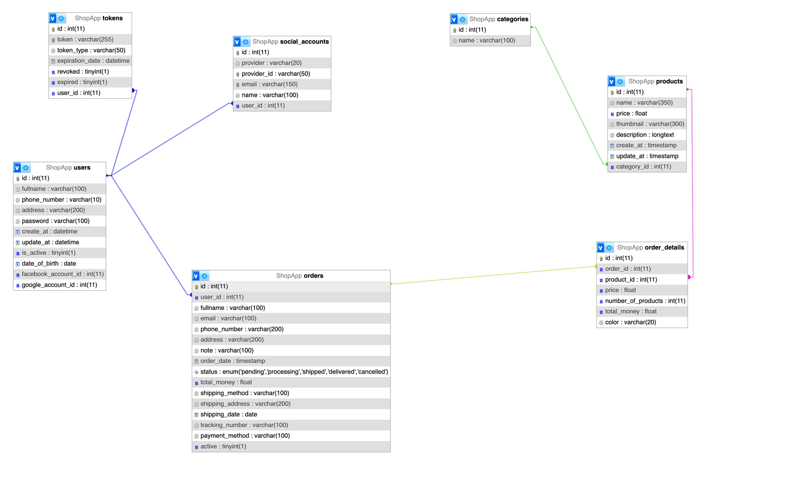

## Thiết Kế database cho Shop app 

 
## **1. Một số lý thuyết quan trọng khi sử dung Design** 
 - ` id int PRIMARY KEY AUTO_INCREMENT,` : Đây là trường id khóa chính và tự động tăng giá trị. 
 -  `is_active TINYINT(1) DEFAULT 1,` : Đây dùng để hiểu là thanh trạng thái hoạt động hoặc đang tắt hoạt động 
#### Trong bảng tokens : 
- `expiration_date DATETIME` : cột này để lưu thời gian hết hạn của token. 
- `revoked TINYINT(1) NOT NULL` :cột này đánh dấu xem token đã hết hạn hay chưa, token đã bị thu hồi trước khi hết hạn.
- `expired TINYINT(1) NOT NULL` : tương tự cột revoked,giá trị 0 có thể biểu thị ``chưa hết hạn``, và 1 biểu thị ``đã hết hạn``, token đã hết hạn theo thời gian.
- 

#### Trong bảng products  
- `FOREIGN KEY (category_id) REFERENCES categories(id)` Quan hệ một nhiều điêù này nghĩa là category trong bảng product đúng là id trong bảng categories.
  - Bảng categories (danh mục sản phẩm):
  |id|	name|
  | --- | --- |
  |1	|Electronics|
  |2	|Clothing|
  |3 |	Books|

  - Bảng products (sản phẩm):
    |id	|name|	price	|category_id|
  | --- | --- | --- | --- |
    |1|	Laptop|	1000|	1|
    |2|	T-Shirt|	20|	2|
   | 3|	Novel	|15|	3|
   | 4|	Smartphone |	700|	1|

- `TIMESTAMP` có ưu điểm là tự động cập nhật và chuyển đổi múi giờ, phù hợp để theo dõi thời gian trong hệ thống.

### Nếu muốn thêm một cột sau khi tạo rồi thì dùng ALTER: 
```shell
ALTER TABLE orders ADD COLUMN `shipping_method` VARCHAR(100);
ALTER TABLE orders ADD COLUMN `shipping_address` VARCHAR(200);
ALTER TABLE orders ADD COLUMN `shipping_date` DATE;
ALTER TABLE orders ADD COLUMN `tracking_number` VARCHAR(100);
ALTER TABLE orders ADD COLUMN `payment_method` VARCHAR(100);
--xóa 1 đơn hàng => xóa mềm => thêm trường active
ALTER TABLE orders ADD COLUMN active TINYINT(1);
--Trạng thái đơn hàng chỉ đc phép nhận "một số giá trị cụ thể"
ALTER TABLE orders 
MODIFY COLUMN status ENUM('pending', 'processing', 'shipped', 'delivered', 'cancelled') 
COMMENT 'Trạng thái đơn hàng';
```


