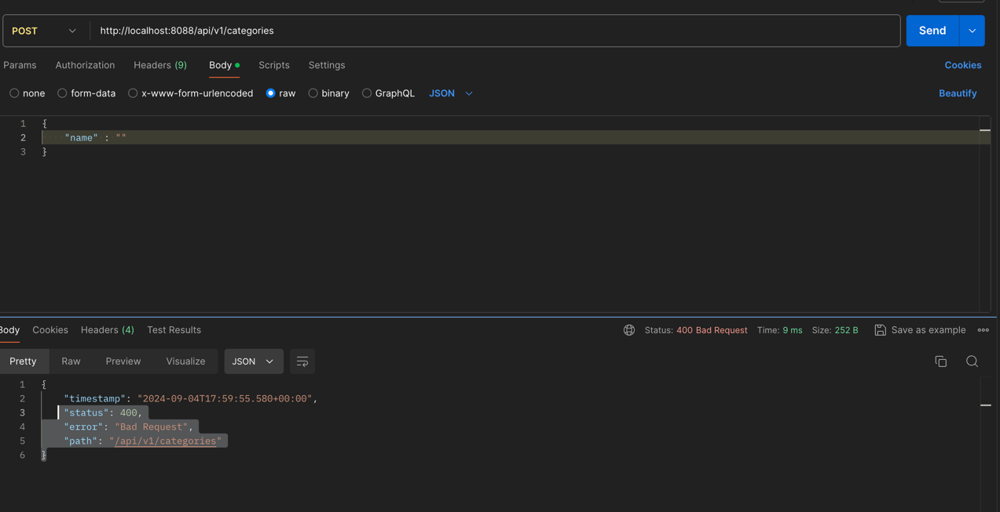

# Java Spring Boot backend (P1)

## Đối với class Category 

### *1. Lý thuyết*
- Một số lý thuyết về anotation 
- `@RequestBody` : Được hiểu như là nó sẽ chạy vào `body` khi mình truyền vào gì 
- `@RequestParam` : Mình chuyền vào cái gì
- `@NotNull` : từ chối giá trị `null` hoặc `không có` nhưng `chấp nhận giá trị rỗng(empty)`.
- `@NotEmpty` : cả giá trị null lẫn giá trị rỗng bằng cách kiểm tra `độ dài (length)` `(String)` hoặc kích thước `(size)` (Collection) xem có `lớn hơn 0 hay không`.
- `@NotBlank` : Annotation này `từ chối String có giá trị null` và String có `độ dài là 0` sau khi đã trim (loại bỏ hết khoảng trắng thừa ở đầu và cuối của String)
- 
### *2. Giải thích*


### *3. Một số lỗi thường gặp* 
#### Hiễn mã lỗi trong posman


*Khi chưa fix lỗi*
- Trường hơpj là name = empty, nhưng trong package dtos có annotation `NOTEMPTY `

```java 
    public ResponseEntity<String> insertCategory(@Valid @RequestBody CategoryDTO categoryDTO) {
        return ResponseEntity.ok("Insert category thành công: " + categoryDTO);
    }
```

 
*Tôi muốn hiện ra như này*
- sửa đoạn code 
```java 
     public ResponseEntity<?> insertCategory( // Nếu chuyển ?--> sang kiểu string thì nó không nhận , vậy phải để kiểu ? để nó nhận thêm kiểu (List và String)
        @Valid @RequestBody CategoryDTO categoryDTO,
        BindingResult result) {
    if (result.hasErrors()) {
        String errorMessages = String.valueOf(result.getFieldErrors()
                .stream()
                .map(FieldError::getDefaultMessage)
                .toList());
        return ResponseEntity.badRequest().body(errorMessages);
    }
    return ResponseEntity.ok("Insert category thành công: " + categoryDTO);
}
```
 > Lưu ý: phải xóa anotation `@Validated` đi bởi vì khi chạy vào class nó sẽ tự hiểu chạy vào annotation này mà không valid ở trên 
 
 *Nó sẽ hiễn mã lỗi 500*

#### Xử lý lỗi xác thực bằng BindingResult
- `BingdingResult` là nơi mà spring chứa xác thực dữ liệu 
- Nếu như có lỗi xác thực đầu vào thì ta dùng `BindingResult.hasErrors():`
```java
    @PostMapping(consumes = MediaType.APPLICATION_JSON_VALUE)
    public String createPerson(@RequestBody @Valid PersonRequest request, BindingResult bindingResult) {
    if (bindingResult.hasErrors()) {
        return "Một hoặc nhiều trường truyền vào không hợp lệ!";
    }
}
```
> Các này sẽ không biết cái cụ thể trường nào lỗi và vì sao lại lỗi. 
##### Khắc phục chúng ta dùng : `BindingResult.getFieldErrors` để lấy tất cả các trường bị lỗi bao gồm cả message. 
```java 
    @PostMapping(consumes = MediaType.APPLICATION_JSON_VALUE)
    public String createPerson(@RequestBody @Valid PersonRequest request, BindingResult bindingResult) {

        if(bindingResult.hasErrors()){
            Map<String, String> errors= new HashMap<>(); // Quan Trọng vì cái này sẽ lưu các trường vào đây 

            bindingResult.getFieldErrors().forEach(
                    error -> errors.put(error.getField(), error.getDefaultMessage())
            );

            String errorMsg= "";

            for(String key: errors.keySet()){
                errorMsg+= "Lỗi ở: " + key + ", lí do: " + errors.get(key) + "\n";
            }
            return errorMsg;
        }

        //TODO: Thêm code gọi xuống service layer
        log.info(request.toString());
        return "Các trường truyền vào hợp lệ!";
    }
```

### Nếu muốn custome mã lỗi riêng thì ta làm như sau 

```java 
@Documented
@Constraint(validatedBy = CapitalizedValidator.class)
@Target( { ElementType.METHOD, ElementType.FIELD })
@Retention(RetentionPolicy.RUNTIME)
public @interface CapitalizedConstraint {
    String message() default "Chữ đầu tiên phải được in hoa!";
    Class<?>[] groups() default {};
    Class<? extends Payload>[] payload() default {};
}
```

```java 
 public class CapitalizedValidator implements ConstraintValidator<CapitalizedConstraint, String> {
 @Override
 public void initialize(CapitalizedConstraint constraintAnnotation) {
  ConstraintValidator.super.initialize(constraintAnnotation);
 }

 @Override
 public boolean isValid(String value, ConstraintValidatorContext context) {
  if(!StringUtils.hasLength(value)) return Boolean.FALSE;
  if(!Character.isUpperCase(value.charAt(0))) return Boolean.FALSE;

  return Boolean.TRUE;
 }
}
```
- Cuối cùng ta thêm annotation vào 
```java @CapitalizedConstraint
private String name;
```


