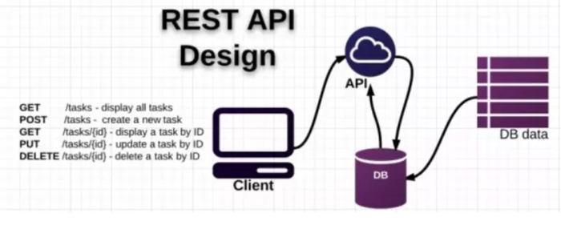

# Java Core

## Constructor

- **Constructor là gì:** Là phương thức đặc biệt để tạo đối tượng của 1 lớp. Nó có chức năng tạo ra một đối tượng mới của lớp đó và khởi tạo các thuộc tính của đối tượng đó.
- **Có mấy loại constructor:** 2 loại: `default/no-argument` và `parameter`.
- **Constructor trả về kiểu giá trị gì:** Không có kiểu trả về.
- **Constructor có được kế thừa không:** Không. Khi tạo lớp con sẽ không kế thừa các constructor của lớp cha ⇒ phải tự định nghĩa constructor riêng của nó. Nếu muốn gọi constructor lớp cha thì phải sử dụng `super()`.
- **Có thể tạo constructor `final` không:** Không ⇒ Nếu sử dụng sẽ bị lỗi biên dịch. Vì constructor không có hành vi kế thừa như phương thức hoặc lớp, không cần thiết phải sử dụng từ khóa `final` với constructor.

```java
class Person {
    String name;
    int age;

    // Default constructor
    public Person() {
        this.name = "Unknown";
        this.age = 0;
    }

    // Parameterized constructor
    public Person(String name, int age) {
        this.name = name;
        this.age = age;
    }

    public void display() {
        System.out.println("Name: " + name + ", Age: " + age);
    }

    public static void main(String[] args) {
        Person person1 = new Person();
        person1.display(); // Output: Name: Unknown, Age: 0

        Person person2 = new Person("Alice", 25);
        person2.display(); // Output: Name: Alice, Age: 25
    }
}
```

## Biến static

- **Biến static là gì:** Là biến thuộc về lớp, không thuộc về riêng đối tượng nào cả ⇒ tất cả các đối tượng trong cùng 1 lớp sẽ chia sẻ chung biến static.
- **Biến static chỉ khởi tạo 1 lần** khi lớp được nạp vào bộ nhớ. Nó giữ giá trị của nó trong suốt vòng đời của chương trình hoặc khi lớp không còn tồn tại.
- **Ứng dụng:** Lưu các giá trị không thay đổi, chẳng hạn như các URL, cấu hình ứng dụng, hoặc thông tin khác cần sử dụng xuyên suốt ứng dụng.
```java
  class Counter {
    static int count = 0;

    public Counter() {
        count++;
    }

    public static int getCount() {
        return count;
    }

    public static void main(String[] args) {
        Counter c1 = new Counter();
        Counter c2 = new Counter();
        Counter c3 = new Counter();

        System.out.println("Total objects created: " + Counter.getCount()); // Output: Total objects created: 3
    }
}
```

## Phương thức static

- **Phương thức static là gì:** Là phương thức thuộc về lớp, không thuộc về object riêng nào cả.
- **Ứng dụng:**
    - Cung cấp các phương thức tiện ích chung không cần truy cập đến trạng thái của đối tượng.
```java
    class Counter {
    static int count = 0;

    public Counter() {
        count++;
    }

    public static int getCount() {
        return count;
    }

    public static void main(String[] args) {
        Counter c1 = new Counter();
        Counter c2 = new Counter();
        Counter c3 = new Counter();

        System.out.println("Total objects created: " + Counter.getCount()); // Output: Total objects created: 3
    }
}
```

## Tại sao phương thức `main` là static?

- Khi chạy chương trình Java thì JVM cần 1 điểm khởi đầu để bắt đầu thực thi chương trình ⇒ Phương thức `main` chính là điểm khởi đầu này.
- JVM không tạo một đối tượng của lớp chứa phương thức `main` trước khi gọi phương thức đó. Thay vào đó, JVM gọi phương thức `main` trực tiếp để bắt đầu chương trình. Nếu `main` không phải là `static`, JVM sẽ không thể gọi nó mà không có một đối tượng của lớp.

## Sự khác nhau giữa phương thức static và phương thức instance

| Phương thức static | Phương thức instance |
| --- | --- |
| Là phương thức thuộc về lớp | Là phương thức thuộc về đối tượng cụ thể |
| Được khởi tạo khi lớp được nạp vào bộ nhớ, trước khi bất kỳ đối tượng nào của lớp được tạo ra | Được khởi tạo khi một đối tượng của lớp được tạo ra |
| Không phụ thuộc vào bất kỳ đối tượng nào | Phụ thuộc vào đối tượng của lớp. Mỗi đối tượng có thể gọi các phương thức `instance` của chính nó |

## `This` trong Java là gì?

- Đại diện cho đối tượng hiện tại của lớp.
- Dùng để phân biệt biến instance và tham số phương thức có cùng tên.
- Dùng để gọi các phương thức và constructor khác trong cùng một lớp.

## `Super` là gì?

- Đại diện cho lớp cha của đối tượng hiện tại.
- Dùng để truy cập các thành phần lớp cha từ lớp con, bao gồm việc gọi phương thức và constructor lớp cha.

## Có thể sử dụng cả `this` và `super` trong 1 constructor không?

- Có thể, tuy nhiên phải theo thứ tự: `super` → `this`.
- Nếu gọi `this` trước `super` → xảy ra lỗi biên dịch.

## Lớp nào là lớp cha cho tất cả các lớp?

- Lớp **Object**.
- Tất cả các lớp kế thừa từ lớp `Object`, và do đó, có quyền truy cập vào các phương thức cơ bản mà `Object` cung cấp.

## Tại sao đa kế thừa không được hỗ trợ trong Java?

- Tránh diamond problem. Ví dụ: class C kế thừa từ class A và B. Trong A và B đều có phương thức `printInfo()` thì C không biết kế thừa từ class nào.
- Có thể sử dụng interface để thay thế cho đa kế thừa.

## Sự khác nhau giữa aggregation và composition

| Aggregation | Composition |
| --- | --- |
| Đối tượng chứa chỉ giữ tham chiếu đến các đối tượng thành phần. Các đối tượng thành phần có thể tồn tại độc lập và có thể được chia sẻ giữa nhiều đối tượng chứa | Đối tượng chứa hoàn toàn sở hữu các đối tượng thành phần. Khi đối tượng chứa bị hủy, các đối tượng thành phần cũng bị hủy |
| Mối quan hệ là lỏng lẻo. Đối tượng thành phần có thể tồn tại và được sử dụng bởi nhiều đối tượng chứa khác nhau | Mối quan hệ là chặt chẽ. Đối tượng thành phần không thể tồn tại mà không có đối tượng chứa |
| Đối tượng thành phần thường được khởi tạo ngoài constructor của đối tượng chứa và được gán sau | Đối tượng thành phần thường được khởi tạo trong constructor của đối tượng chứa |

## Object cloning là gì?

- Là quá trình tạo ra 1 bản sao của đối tượng. Quá trình này tạo ra một đối tượng mới với các giá trị giống hệt đối tượng gốc, nhưng có tham chiếu (reference) khác.
- **Có 2 cách để thực hiện cloning:**
    1. Sử dụng `Cloneable` Interface và `Object.clone()` Method.
    2. Sử dụng Constructor sao chép hoặc Phương Thức sao chép.
- **Mục đích:** Clone giúp tạo ra các bản sao của đối tượng để làm việc hoặc thử nghiệm mà không ảnh hưởng đến đối tượng gốc.

## Overloading phương thức là gì?

- Là một tính năng trong Java cho phép một lớp có nhiều phương thức cùng tên nhưng khác nhau về danh sách tham số (số lượng hoặc kiểu tham số). Overloading không phụ thuộc vào kiểu trả về của phương thức, nghĩa là không thể tạo ra nhiều phương thức chỉ khác nhau về kiểu trả về.
- Điều này giúp tạo nhiều phương thức có cùng 1 tên nhưng có thể xử lý các kiểu dữ liệu khác nhau/số lượng tham số khác nhau.

## Tại sao overloading phương thức không xảy ra khi thay đổi kiểu giá trị trả về?

- Vì điều này gây ra sự không rõ ràng trong việc chọn phương thức khi gọi.
- Ví dụ: lúc này nếu gọi phương thức `add` thì sẽ không biết gọi cái nào ⇒ lỗi biên dịch `method add(int,int) is already defined in class Example`.

    ```java
    class Example {
        // Phương thức 1
        public int add(int a, int b) {
            return a + b;
        }
    
        // Phương thức 2
        public double add(int a, int b) {
            return a + b + 0.5;
        }
    }
    ```

## Có thể overload phương thức `main` không?

- Có thể, tuy nhiên khi chạy ứng dụng JVM chỉ gọi phương thức `main(String[] args)` và bỏ qua các phiên bản overload khác.

## Ghi đè phương thức là gì?

- Là kỹ thuật cho phép lớp con kế thừa phương thức từ lớp cha và thay đổi hành vi của nó để phù hợp với nhu cầu cụ thể.
- **Quy tắc:**
    - Phương thức ghi đè phải có cùng chữ ký với phương thức trong lớp cha.
    - Không thể có phạm vi truy cập chặt chẽ hơn.
    - Không thể là `static`.
    - Các phương thức `final`, `static`, và `private` không thể bị ghi đè.

## Tại sao không thể ghi đè phương thức `static`?

- Vì phương thức static thuộc về class chứ không thuộc về đối tượng.

## Có thể ghi đè phương thức đã nạp chồng không?

- Có thể, phương thức ghi đè trong lớp con phải có cùng chữ ký với phương thức trong lớp cha mà nó ghi đè.

## Có thể ghi đè biến instance không?

- Không thể ghi đè các biến instance.
- Nếu lớp con định nghĩa một biến với cùng tên như trong lớp cha, biến này sẽ ẩn biến của lớp cha nhưng không thay thế nó. Biến trong lớp con và lớp cha vẫn tồn tại độc lập và có thể được truy cập dựa trên tham chiếu đối tượng.

## Sự khác nhau giữa overload và override

| Overload | Override |
| --- | --- |
| Xảy ra trong cùng 1 lớp hoặc lớp con | Xảy ra khi lớp con định nghĩa phương thức với cùng tên và danh sách tham số như phương thức trong lớp cha |
| Các phương thức phải có cùng tên nhưng khác nhau về danh sách tham số | Phương thức phải có cùng chữ ký với phương thức cha |
| Không liên quan đến kế thừa, không thay thế phương thức | Có liên quan đến kế thừa, thay thế hành vi của phương thức trong lớp cha |

## Kiểu trả về hiệp biến là gì?

- Là khả năng của phương thức ghi đè trong lớp con để trả về một kiểu dữ liệu con của kiểu dữ liệu trả về trong phương thức lớp cha.

## Biến/phương thức/class `final` là gì?

- **Biến `final`:**
    - **Biến Instance/Static:** Giá trị không thể thay đổi sau khi được gán.
    - **Biến Cục Bộ:** Không thể gán lại giá trị sau lần gán đầu tiên.
- **Phương thức `final`:**
    - Không thể ghi đè.
    - Tăng hiệu năng khi không cần phải kiểm tra ghi đè.
- **Class `final`:**
    - Không thể tạo lớp con.
    - Bảo vệ class khỏi sự thay đổi.
```java
     final class Constants {
    public static final int MAX_AGE = 100;
}

class TestFinal {
    public static void main(String[] args) {
        // Constants.MAX_AGE = 120; // Error: Cannot assign a value to final variable 'MAX_AGE'
        System.out.println(Constants.MAX_AGE); // Output: 100
    }
}
```

## Interface là gì?

- Là một bộ quy tắc (contracts) mà các lớp phải tuân theo. Nó chỉ định các phương thức mà một lớp phải triển khai mà không cung cấp bất kỳ thực thi nào.
- **Ứng dụng:** Định nghĩa các chức năng cơ bản mà các lớp cần tuân theo. Cho phép tạo ra các hệ thống linh hoạt và dễ mở rộng.

## `Abstract class` là gì?

- Là một lớp không thể tạo ra đối tượng từ nó, chỉ có thể được kế thừa.
- Nó có thể có cả phương thức `abstract` (không có thân phương thức) và `non-abstract`.
- **Ứng dụng:** Dùng khi có một số hành vi chung mà các lớp con có thể chia sẻ, nhưng các lớp con cũng cần triển khai các phương thức cụ thể riêng của mình.

```java
// Interface
interface AnimalInterface {
    void eat();
    void sleep();
}

// Abstract class
abstract class AnimalAbstract {
    abstract void eat();

    void sleep() {
        System.out.println("Sleeping");
    }
}

// Implementing interface
class Dog implements AnimalInterface {
    public void eat() {
        System.out.println("Dog is eating");
    }

    public void sleep() {
        System.out.println("Dog is sleeping");
    }
}

// Extending abstract class
class Cat extends AnimalAbstract {
    void eat() {
        System.out.println("Cat is eating");
    }
}

public class Main {
    public static void main(String[] args) {
        Dog dog = new Dog();
        dog.eat(); // Output: Dog is eating
        dog.sleep(); // Output: Dog is sleeping

        Cat cat = new Cat();
        cat.eat(); // Output: Cat is eating
        cat.sleep(); // Output: Sleeping
    }
}
```
## `String` là gì? Tại sao `String` là bất biến (immutable)?

- **`String` là một lớp đặc biệt trong Java** để lưu trữ và xử lý chuỗi văn bản.
- **Bất biến (immutable):** Mỗi khi thao tác trên `String`, một đối tượng mới được tạo ra thay vì thay đổi đối tượng hiện tại. Điều này giúp tăng cường bảo mật và hiệu suất.

## Khác nhau giữa lớp `String`, `StringBuffer` và `StringBuilder`

- **`String`:** Bất biến (immutable), an toàn cho việc sử dụng trong môi trường đa luồng, nhưng tốn bộ nhớ hơn khi thực hiện nhiều thao tác.
- **`StringBuffer`:** Có thể thay đổi (mutable), an toàn cho việc sử dụng trong môi trường đa luồng, hiệu năng thấp hơn `StringBuilder`.
- **`StringBuilder`:** Có thể thay đổi (mutable), không an toàn cho việc sử dụng trong môi trường đa luồng, hiệu năng cao hơn `StringBuffer`.

```java
public class StringExample {
    public static void main(String[] args) {
        // Immutable String
        String str = "Hello";
        str = str.concat(" World");
        System.out.println(str); // Output: Hello World

        // StringBuffer (Thread-safe)
        StringBuffer sb = new StringBuffer("Hello");
        sb.append(" World");
        System.out.println(sb); // Output: Hello World

        // StringBuilder (Not thread-safe, but faster)
        StringBuilder sbuilder = new StringBuilder("Hello");
        sbuilder.append(" World");
        System.out.println(sbuilder); // Output: Hello World
    }
}

```

## Sự khác nhau giữa `equals()` và `==` trong Java

- **`equals()`** so sánh nội dung của hai đối tượng (method này có thể được override trong các class để định nghĩa cách so sánh cụ thể).
- **`==`** so sánh tham chiếu (reference) của hai đối tượng, tức là kiểm tra xem hai đối tượng có cùng tham chiếu đến cùng một vùng nhớ hay không.
```java
class Person {
    String name;
    int age;

    public Person(String name, int age) {
        this.name = name;
        this.age = age;
    }

    @Override
    public boolean equals(Object obj) {
        if (this == obj) return true;
        if (obj == null || getClass() != obj.getClass()) return false;
        Person person = (Person) obj;
        return age == person.age && name.equals(person.name);
    }

    @Override
    public int hashCode() {
        return Objects.hash(name, age);
    }

    public static void main(String[] args) {
        Person p1 = new Person("John", 25);
        Person p2 = new Person("John", 25);

        System.out.println(p1.equals(p2)); // Output: true
    }
}
```

## Có thể ghi đè phương thức `equals()` không?

- Có thể ghi đè phương thức `equals()` để định nghĩa cách so sánh nội dung của hai đối tượng.
- Tuy nhiên, khi ghi đè `equals()`, cần phải tuân thủ hợp đồng (contract) của phương thức này, như: tính đối xứng, tính phản xạ, và tính chuyển tiếp.

## Phương thức `hashCode()` là gì?

- Là phương thức trả về một giá trị số nguyên (hash code) biểu diễn cho đối tượng, được sử dụng chủ yếu trong các cấu trúc dữ liệu như `HashMap`, `HashSet`.
- **Ghi đè `hashCode()` khi ghi đè `equals()`:** Để đảm bảo rằng hai đối tượng bằng nhau theo phương thức `equals()` thì cũng phải có cùng giá trị `hashCode()`.

## So sánh interface và abstract class

| Interface | Abstract class |
| --- | --- |
| Chỉ có thể chứa phương thức abstract và thuộc tính tĩnh (static). Từ Java 8 trở đi, có thể có phương thức default và static với thân phương thức | Có thể chứa cả phương thức abstract và non-abstract |
| Không có constructor | Có constructor |
| Một lớp có thể implement nhiều interface | Một lớp chỉ có thể kế thừa từ một abstract class |
| Tất cả các phương thức đều ngầm định là public và abstract (trước Java 8) | Các phương thức có thể có bất kỳ phạm vi truy cập nào |
| Các thuộc tính ngầm định là public, static và final | Có thể có các thuộc tính instance không phải final |

## Boxing/unboxing là gì?

- **Boxing** là quá trình chuyển đổi kiểu dữ liệu nguyên thủy (primitive type) thành đối tượng của lớp wrapper tương ứng (e.g., int → Integer).
- **Unboxing** là quá trình ngược lại, chuyển đổi đối tượng của lớp wrapper thành kiểu dữ liệu nguyên thủy.
  - Ví dụ: int (kiểu nguyên thủy) -> Integer (lớp wrapper).


```java
public class BoxingUnboxing {
    public static void main(String[] args) {
        // Boxing: converting primitive to wrapper object
        int num = 5;
        Integer boxedNum = num; // Autoboxing

        // Unboxing: converting wrapper object to primitive
        Integer obj = new Integer(10);
        int unboxedNum = obj; // Auto-unboxing

        System.out.println("Boxed: " + boxedNum); // Output: Boxed: 5
        System.out.println("Unboxed: " + unboxedNum); // Output: Unboxed: 10
```

## Chuyển kiểu tường minh (type casting)

- Là quá trình chuyển đổi một kiểu dữ liệu này thành kiểu dữ liệu khác theo yêu cầu của lập trình viên.

### Upcasting

- Chuyển từ kiểu con thành kiểu cha.
- **Cú pháp:** `ClassCha obj = (ClassCha) objCon`.

### Downcasting

- Chuyển từ kiểu cha thành kiểu con.
- **Cú pháp:** `ClassCon obj = (ClassCon) objCha`.

- Khi sử dụng downcasting, cần kiểm tra kiểu dữ liệu bằng toán tử `instanceof` để đảm bảo an toàn.

## Static binding vs Dynamic binding

- **Static binding:** Xảy ra trong thời gian biên dịch. Sử dụng cho phương thức static, final, và private.
- **Dynamic binding:** Xảy ra trong thời gian chạy. Sử dụng cho các phương thức instance và override.

```java
class StaticBindingExample {
    private void display() {
        System.out.println("Static Binding Example");
    }

    public static void main(String[] args) {
        StaticBindingExample obj = new StaticBindingExample();
        obj.display(); // Output: Static Binding Example (Resolved at compile-time)
    }
}

class Animal {
    void sound() {
        System.out.println("Animal sound");
    }
}

class Dog extends Animal {
    @Override
    void sound() {
        System.out.println("Dog barks");
    }

    public static void main(String[] args) {
        Animal obj = new Dog();
        obj.sound(); // Output: Dog barks (Resolved at runtime)
    }
}
```

## Các thành phần trong OOP

1. **Inheritance:** Kế thừa tính năng của lớp cha.
2. **Polymorphism:** Đa hình, tức là cùng một hành vi có thể có nhiều hình thức khác nhau.
3. **Encapsulation:** Đóng gói, tức là ẩn giấu các chi tiết thực hiện và chỉ cung cấp những thông tin cần thiết ra bên ngoài.
4. **Abstraction:** Trừu tượng hóa, tức là chỉ giữ lại những thông tin quan trọng và ẩn đi các chi tiết phức tạp.


## Tìm hiểu về `RESTfull api`
RESTful API là một tiêu chuẩn dùng trong việc thiết kế API cho các ứng dụng web (thiết kế Web services) để tiện cho việc quản lý các resource. Được truyền tải qua HTTP
Các API RESTful thường được sử dụng để giao tiếp giữa các ứng dụng qua HTTP, với các quy tắc và phương thức cụ thể nhằm đảm bảo việc trao đổi dữ liệu diễn ra dễ dàng, nhất quán và có thể mở rộng.
#### Cách phương thúc 
`PATCH`


#### Các thành phần của nó: 
`API` (Application Programming Interface) :là một tập các quy tắc và cơ chế mà theo đó, một ứng dụng hay một thành phần sẽ tương tác với một ứng dụng
`REST`(REpresentational State** T**ransfer) : là một dạng chuyển đổi cấu trúc dữ liệu Nó sử dụng phương thức HTTP đơn giản để tạo cho giao tiếp giữa các máy

## Tổ chức project trong Spring Boot , nêu ý nghĩa các package trong Spring Boot
#### Tổ Chức Source Code Theo Mô Hình 3 Lớp
##### 1. Presentation Layer(Tầng trình diễn)
